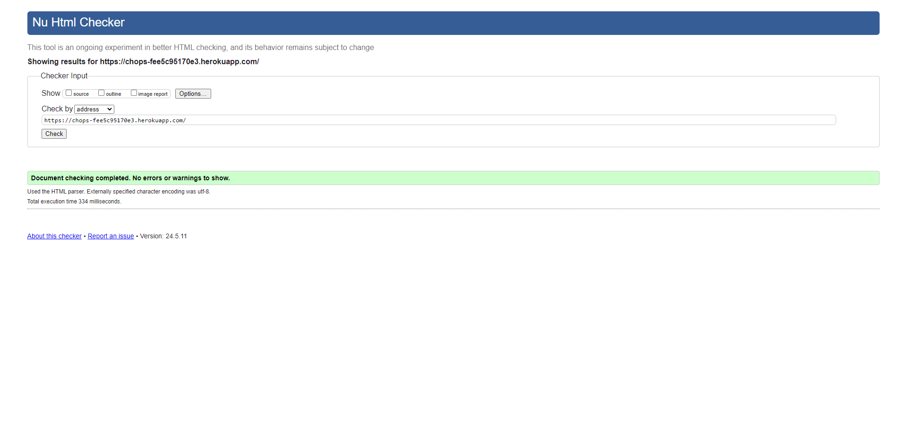
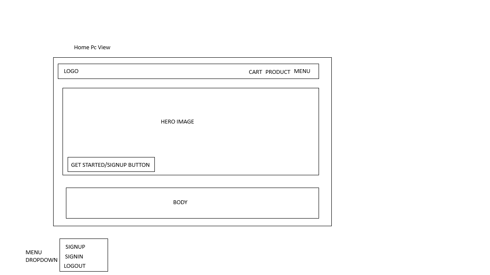
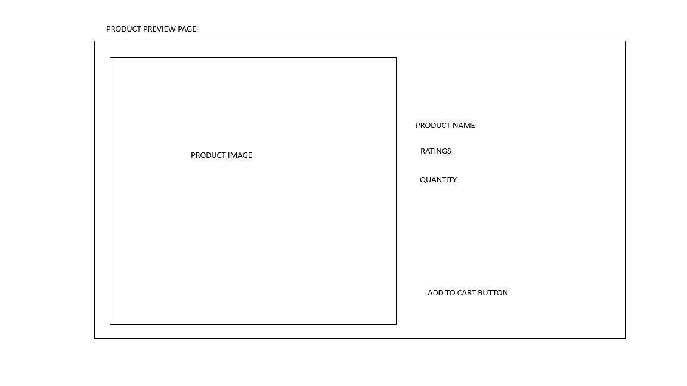

# CHOPS
This project [chops](https://chops-fee5c95170e3.herokuapp.com/) is a minimalistic eccormmerce site for the sales of different kinds of meals
<!--  -->
# User Experience (UX)
Key information for the app
this section provides insight into the UX process, focusing on who the app is for, the main aims of the project and how the app can help users meet their needs
<!-- 
 -->

# Project goals:<br>
 User able to login

 integrated alluth

 able to search for meal based on names
<!--   -->
<br>

able to add to cart even without logging in

sychronizing your cart after loggin in
<!--  -->

making purchase for more a meal multiple time
<!--  -->
<br>


# Features:<br>
Login
 <br>

Signup
 <br>

products
 <br>

# validation

Sure, here’s a rephrased version reflecting the steps taken during the W3C validation process:

---

# Steps Taken for W3C Validation Testing
 <br>

### Step-by-Step Process

1. **Prepared Web Pages**
   - I ensured that all HTML, CSS, and other web assets were finalized and ready for validation.

2. **Utilized W3C Validator Tools**
   - I used the W3C's online validation tools, specifically:
     - **HTML Validator:** [W3C Markup Validation Service](https://validator.w3.org/)
     - **CSS Validator:** [W3C CSS Validation Service](https://jigsaw.w3.org/css-validator/)

3. **Validated HTML**
   - Navigated to the W3C Markup Validation Service.
   - Validated by:
     - **URI:** Entered the URL of the web page I wanted to validate.
     - **File Upload:** Uploaded the HTML file directly.
     - **Direct Input:** Copied and pasted the HTML code into the provided text area.
   - Clicked the "Check" button.
   - Reviewed the results where the validator listed errors and warnings.

4. **Validated CSS**
   - Went to the W3C CSS Validation Service.
   - Validated by:
     - **URI:** Entered the URL of the web page or stylesheet.
     - **File Upload:** Uploaded the CSS file.
     - **Direct Input:** Copied and pasted the CSS code.
   - Clicked the "Check" button.
   - Reviewed the results where the validator listed errors and warnings specific to CSS.

5. **Fixed Validation Errors**
   - Used the feedback from the validators to correct errors and warnings in the HTML and CSS.
   - Common HTML fixes included adding missing alt attributes for images, proper nesting of elements, and replacing deprecated tags.
   - Common CSS fixes involved correcting syntax errors, addressing unsupported properties, and handling validation warnings related to vendor prefixes.

6. **Revalidated**
   - After making the corrections, I revalidated the web pages to ensure all issues were resolved.

### Example

Here is a simple example of a validation check for a sample HTML and CSS file.

#### Sample HTML (index.html)
```html

<!DOCTYPE html>
<html lang="zxx">
  <head>
    <meta name="viewport" content="width=device-width, initial-scale=1.0">
    <title>Home</title>
    

<meta charset="UTF-8">
<meta name="viewport" content="width=device-width, initial-scale=1.0">


    <meta name="description" content="Home">
    <meta name="keywords" content="Ecommerce site">
    <meta name="author" content="dussy">
   
  


    <script src="https://cdn.tailwindcss.com"></script>
    <script src="https://kit.fontawesome.com/8c12befb35.js" crossorigin="anonymous"></script>
 
  </head>
  <body class="w-full  min-h-[100vh] relative">
    <nav class="text-white w-full bg-[rgb(5,5,94)] h-[50px] flex items-center justify-between px-5" >
      <div class="font-bold">
        CHOPS
      </div>
      <div class="flex  gap-[10px] justify-center item-center">
        <a href="/products">Products</a>
        <a href="/cart">cart</a>
        <div class="group/item relative   text-left">
            <div class="">
              <button type="button"   class="topmenu inline-flex items-center justify-center gap-x-1.5 rounded-md bg-white px-3 py-2 text-sm font-semibold text-gray-900 shadow-sm ring-1 ring-inset ring-gray-300 hover:bg-gray-50" id="menu-button" aria-expanded="true" aria-haspopup="true">
                <i class="fa-solid fa-bars"></i> menu
              </button>
            </div>
          
            <!--
              Dropdown menu, show/hide based on menu state.
          
              Entering: "transition ease-out duration-100"
                From: "transform opacity-0 scale-95"
                To: "transform opacity-100 scale-100"
              Leaving: "transition ease-in duration-75"
                From: "transform opacity-100 scale-100" font
                To: "transform opacity-0 scale-95"
            -->
            <div id="123" class="topdropdown hidden  absolute  z-10 mt-2  origin-top-right divide-y text-black divide-gray-100 rounded-md bg-white shadow-lg ring-1 ring-black ring-opacity-5 focus:outline-none" role="menu" aria-orientation="vertical" aria-labelledby="menu-button" tabindex="-1">
                
                <div class="p-1" role="none">
                <a href="/account/email/">Change E-mail</a>
            </div>
                <div class="p-1" role="none">
                    <a href="/account/logout/">Sign Out</a>
                </div>
                      
              
            </div>
          </div>
      </div>


        <!-- <strong><i class="fa-solid fa-bars"></i></strong> -->
    
          <!-- 
    <a href="/account/email/">Change E-mail</a>
        <a href="/account/logout/">Sign Out</a>
           -->
        
    </nav>
    <div class="w-full pb-[200px]">

      
  
      
  
  
  
      

<div class="w-full  ">
    
    <section class="text-white w-full h-[70vh] bg-[url('/static/lidye-1Shk_PkNkNw-unsplash.jpg')] bg-center bg-no-repeat bg-cover flex justify-center flex-col font-bold p-5 ">

        <h3 class="text-[10px] sm:text-[30px] text-[60px] ">Welcome to our</h3>
        <h1 class="text-[20px] sm:text-[50px] md:text-[100px]">E COMMERCE MALL</h1>
        <p class="text-[10px] md:text-[20px]">Lorem ipsum dolor sit amet, consectetur adipisicing elit. Recusandae vitae necessitatibus distinctio voluptatum sunt quae earum fugiat excepturi est ab?</p>

        <a href="/account/signup/" class="w-fit mt-10 px-10 bg-[rgb(5,5,94)] rounded-md p-5">Get Started</a>

    </section>
    <section class=" w-full  bg-center bg-no-repeat bg-cover flex justify-center  flex-col p-5 bg-[rgb(241,241,248)] p-5">
        <h1 class="m-10 text-[20px] font-bold text-center">Our services</h1>
        <div class=" w-full flex justify-center gap-[10px] items-center   bg-white flex-col  md:flex-row">
            <div class="w-[100%] px-5 py-10 flex flex-col justify-center items-center">
                
                <div class="w-full h-[250px] overflow-clip flex justify-center items-center">

                    
                </div>
              <h1>Sumptious</h1>
              <p> Lorem ipsum dolor sit, amet consectetur adipisicing elit. Ullam sunt adipisci laboriosam fuga unde voluptates voluptas ducimus blanditiis odio soluta.</p>
            </div>
            <div class="w-[100%] px-5 py-10 flex flex-col justify-center items-center">
                
                <div class="w-full h-[250px] overflow-clip flex justify-center items-center">

                    
                </div>
              <h1>Sumptious</h1>
              <p> Lorem ipsum dolor sit, amet consectetur adipisicing elit. Ullam sunt adipisci laboriosam fuga unde voluptates voluptas ducimus blanditiis odio soluta.</p>
            </div>
            <div class="w-[100%] px-5 py-10 flex flex-col justify-center items-center">
                
                <div class="w-full h-[250px] overflow-clip flex justify-center items-center">

                    
                </div>
              <h1>Sumptious</h1>
              <p> Lorem ipsum dolor sit, amet consectetur adipisicing elit. Ullam sunt adipisci laboriosam fuga unde voluptates voluptas ducimus blanditiis odio soluta.</p>
            </div>
      
           
           
        </div>
    </section>
    <section class=" w-full  bg-center bg-no-repeat bg-cover flex justify-center  flex-col p-5 bg-[rgb(241,241,248)] p-5">
        <h1 class="m-10 text-[20px] font-bold text-center">sponsored meals</h1>
        <div class=" w-full flex justify-center gap-[10px] items-center   bg-white flex-col  md:flex-row">
            <div class="w-[100%] px-5 py-10 flex flex-col justify-center items-center">
                
                <div class="w-full h-[250px] overflow-clip flex justify-center items-center">

                    
                </div>
              <h1>Sumptious</h1>
              <p> Lorem ipsum dolor sit, amet consectetur adipisicing elit. Ullam sunt adipisci laboriosam fuga unde voluptates voluptas ducimus blanditiis odio soluta.</p>
            </div>
            <div class="w-[100%] px-5 py-10 flex flex-col justify-center items-center">
                
                <div class="w-full h-[250px] overflow-clip flex justify-center items-center">

                    
                </div>
              <h1>Sumptious</h1>
              <p> Lorem ipsum dolor sit, amet consectetur adipisicing elit. Ullam sunt adipisci laboriosam fuga unde voluptates voluptas ducimus blanditiis odio soluta.</p>
            </div>
            <div class="w-[100%] px-5 py-10 flex flex-col justify-center items-center">
                
                <div class="w-full h-[250px] overflow-clip flex justify-center items-center">

                    
                </div>
              <h1>Sumptious</h1>
              <p> Lorem ipsum dolor sit, amet consectetur adipisicing elit. Ullam sunt adipisci laboriosam fuga unde voluptates voluptas ducimus blanditiis odio soluta.</p>
            </div>
      
           
           
        </div>
    </section>
  
</div>


      
      
      
    </div>
    <footer class="bg-[rgb(5,5,94)] text-white w-full h-[150px] absolute bottom-[0px] flex justify-center items-center">
        all right reserved


    </footer>


    <script>
    

        let menutoogle = false
        let menu__ = document.querySelector(".topmenu")
        let dropdown__ = document.querySelector(".topdropdown")
        console.log(dropdown__,menu__)
        menu__.addEventListener("click",e=>{
            console.log("hshsh")
            menutoogle =!menutoogle
            if(menutoogle){
                dropdown__.style.display="block"
    
            }
            else{
                dropdown__.style.display="none"
            }
    
        })
        </script>
  </body>
</html>

```


### Validation Results

- **HTML Validation:**
  - Upon validation, I received a confirmation message that the document was valid.
  - Any errors encountered were listed with line numbers and descriptions.

- **CSS Validation:**
  - Similarly, I received a message about the validity of the CSS.
  - Errors or warnings were detailed for further correction.

### Conclusion

By following these steps, I ensured the quality and compatibility of my web pages through W3C validation. This process helped me avoid common issues and provide a better user experience.

---

Would you need further assistance with specific validation results or resolving particular errors?

# Project workflow:<br>

Auth <br>

The Project implement  django alluth for authentication<br>
AllAuth Takes care of all neccsary authentication template, authenication funtionalities


Product <br>
The project conatined already test data as a dictionary located in the settings.py file

<br>

The project use The browser localstorage to keep track of the cart and checkout system


# Responsiveness<br>

screen w-1700
 <br>


screen w-1500
 <br>

screen w-600
 <br>

screen w-350
 <br>


# WIREFRAME<br>

Certainly! Here’s a text paragraph you can use before presenting your wireframe:

---

### Design Overview

To provide a clear and structured representation of the webpage layout, I have created a wireframe that visually outlines the fundamental components and their arrangement. The wireframe serves as a blueprint, demonstrating the spatial distribution and interaction of elements without delving into the specific design details such as colors, fonts, or images. This approach ensures that the focus remains on the layout and functionality, facilitating a better understanding of the user experience and content organization. Below, you will find the wireframe that corresponds to the HTML code I have developed, illustrating the design framework and the intended structure of the webpage.

---


Home page
 <br>

Product page
 <br>

Product Review page
 <br>


# ADMIN CREDENTIALS<br>
username dussy@gmail.com<br>
password Admin@123<br>


# TEST.........<br>

Model Testing:<br>

Implementing Django testing for models involves creating a structured approach to ensure that the database interactions and business logic encapsulated in your models function as expected. Here is a detailed note on how I implemented Django testing for models in a recent project:

### 1. Setting Up the Testing Environment

**Objective**: Configure the environment for writing and running tests.

- **Installed Dependencies**: Ensured `pytest-django` and `django` were included in the project's `requirements.txt` to facilitate testing.
- **Configured Settings**: Modified `settings.py` to include a separate database for testing to prevent interference with the development and production databases.

### 2. Writing Test Cases

**Objective**: Develop test cases to validate model behavior.

- **Test Suite Structure**: Created a `tests` directory within the Django app directory and added `__init__.py` to recognize it as a module.
- **Test Class**: Created test classes for each model, inheriting from `TestCase` in `django.test`.

```python
from django.test import TestCase
from eccommerce.base.models import OTP
from .models import MyModel


class TestCartModel(TestCase):
    """
    Things to test:
    - Can be create a cart with the bare minimum of fields? (name, image and userid)
    - Does the __str__ method behave as expected?
    
    - Do two carts with the same title and user same id?
    """

    @classmethod
    def setUpTestData(cls):
        cls.user = USER_MODEL.objects.create_user(
            email='janedoe@test.com',
            first_name='Jane',
            last_name='Doe',
            username='user123',
            password='password456'
        )

        cls.cart = CART.objects.create(
            name='rice',
            image='rice.jpg',
            price="20",
            productid="2",
            
            user_id=cls.user.username,
        )


```

### 3. Testing Model Methods

**Objective**: Ensure that custom methods on the models behave correctly.

- **Method Testing**: For models with  methods as str, wrote test cases to verify their output and side effects.

```python


class TestReservationModel(TestCase):
    """
    Things to test:
    - Can be create a cart with the bare minimum of fields? (name, image and userid)
    - Does the __str__ method behave as expected?
    
    - Do two carts with the same title and user same id?
    """

   @classmethod
   def test_cart_str(self):
        """ Tests the __str__ of the cart model"""

        self.assertEqual(str(self.cart), 'usercart')


```

### 4. Testing Model Validations

**Objective**: Ensure that model validations are working as expected.

- **Validation Testing**: Tested the model's field validations by creating instances with invalid data and asserting that errors are raised.

```python
from django.core.exceptions import ValidationError

class MyModelValidationTestCase(TestCase):
   def test_invalid_data(self):
        obj = CART(name="")  # Name is required
        with self.assertRaises(ValidationError):
        
            obj.full_clean()  # This method triggers model validation
```

### 5. Testing Database object are unique

**Objective**: Validate that database constraints (e.g., unique constraints) are enforced.

- **Constraint Testing**: Checked for the enforcement of unique constraints and other database-level validations.

```python
 def test_id_are_unique(self):
        """ Tests two carts with identical titles from the same author receive different slugs """

        second_title = CART.objects.create(
            name='beans',
            price='10',
            image='beans.jpg',
            productid="3",
            user_id=self.user.username,
        )

        self.assertNotEqual(self.cart.productid, second_title.productid)

```

### 6. Running the Tests

**Objective**: Execute the tests to verify model functionality.

- **Command**: Used Django’s built-in test runner to run the test suite.

```bash
python manage.py test
```

- **Pytest**: Alternatively, used `pytest` for running tests to leverage its advanced features and more readable output.

```bash
pytest
```

### Conclusion

By implementing these structured steps for testing Django models, I ensured robust validation of model behaviors, including data integrity, business logic, and database constraints. This process not only helped in catching bugs early but also maintained a high standard of code reliability and quality throughout the development lifecycle.

# TEST.........<br>

 Tests that a GET request works and renders the correct template   

  <br>

  <br>

 Test Model
 The cart model

  <br>

  <br>


# Deployment<br>
``` make a new file name Procfile and do not put any extension in it. It is a file required by Heroku

. For our app we can write the following command "web: gunicorn name_of_your_app.wsgi -log-file -" in the procfile

. pip install gunicorn

. login into heroku in the browser

. Make a new heroku app

. update settings.py file ALLOWED_HOSTS = ["your_app_name.herokuapp.com"]

. With a couple of lines of config WhiteNoise allows your web app to serve its own static files, making it a self-contained unit that can be deployed anywhere without relying on nginx, Amazon S3 or any other external service

so run pip install whitenoise


Add it in MIDDLEWARE in settings.py file

MIDDLEWARE = [
   'django.middleware.security.SecurityMiddleware',
  'whitenoise.middleware.WhiteNoiseMiddleware',
   ...
]

.Make a new Github Repo and add all of your code in it.

.Using Heroku Postgres
Go to your app dashboard and in the Resources section search for Postgres and click add.


. Now paste the following code below DATABASES in settings file

db_from_env = dj_database_url.config(conn_max_age=600)
DATABASES['default'].update(db_from_env)


.Currently, your database is empty and you might want to fill it.

Open terminal
type → heroku login
After the login run the following commands
heroku run python manage.py makemigrations
heroku run python manage.py migrate ...

# Credits<br>
Full credit goes to code institute for the template provided to make this project a possiblityl


