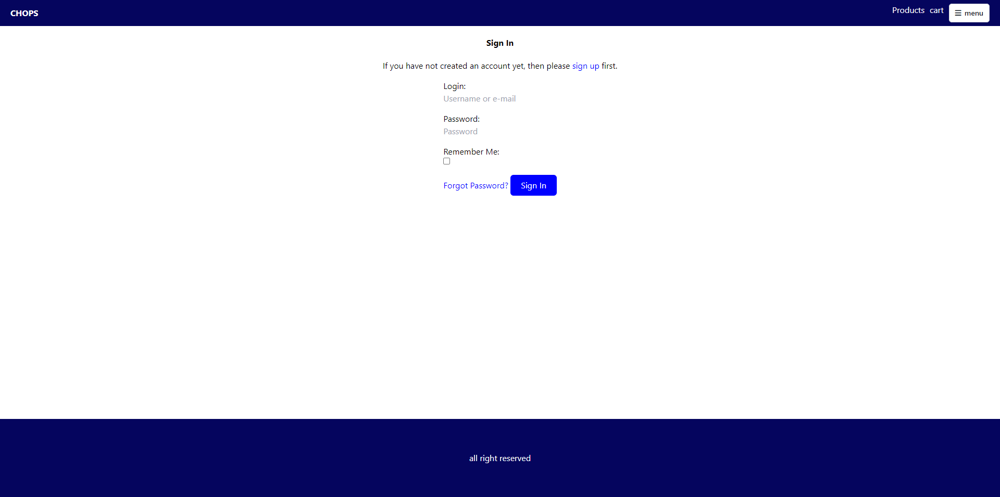
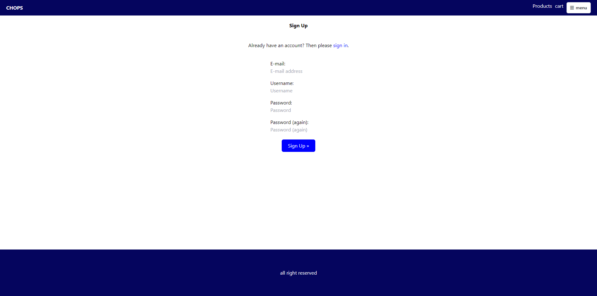
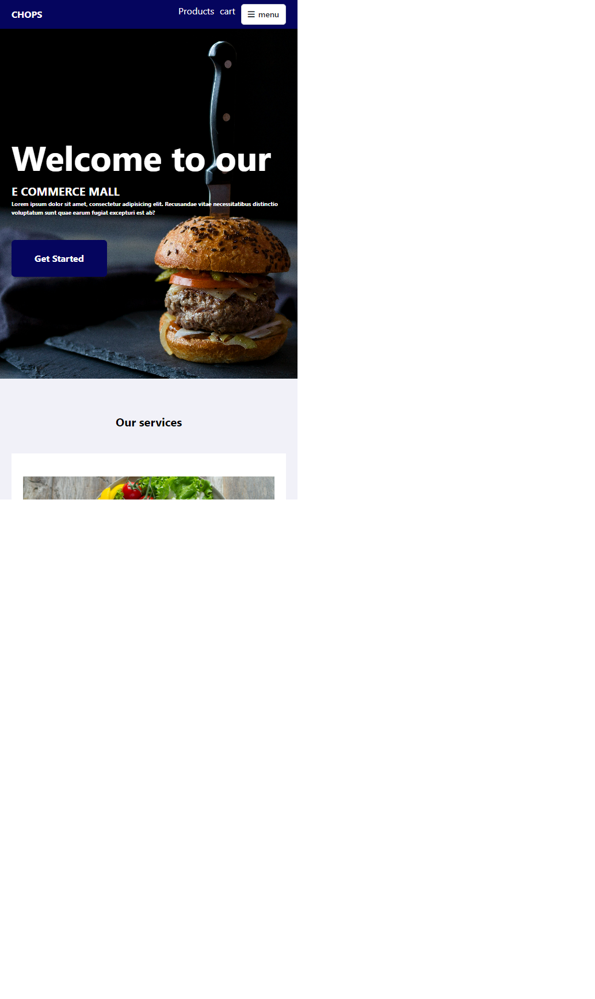
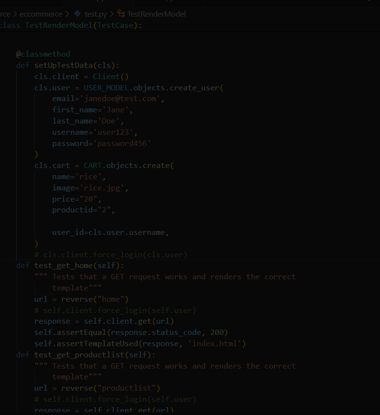
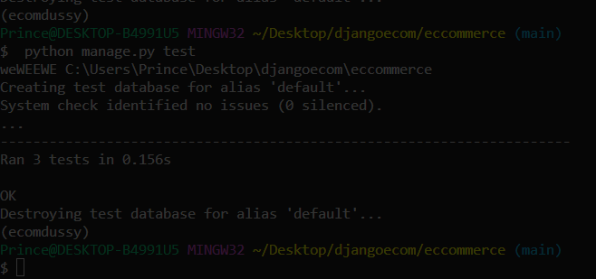
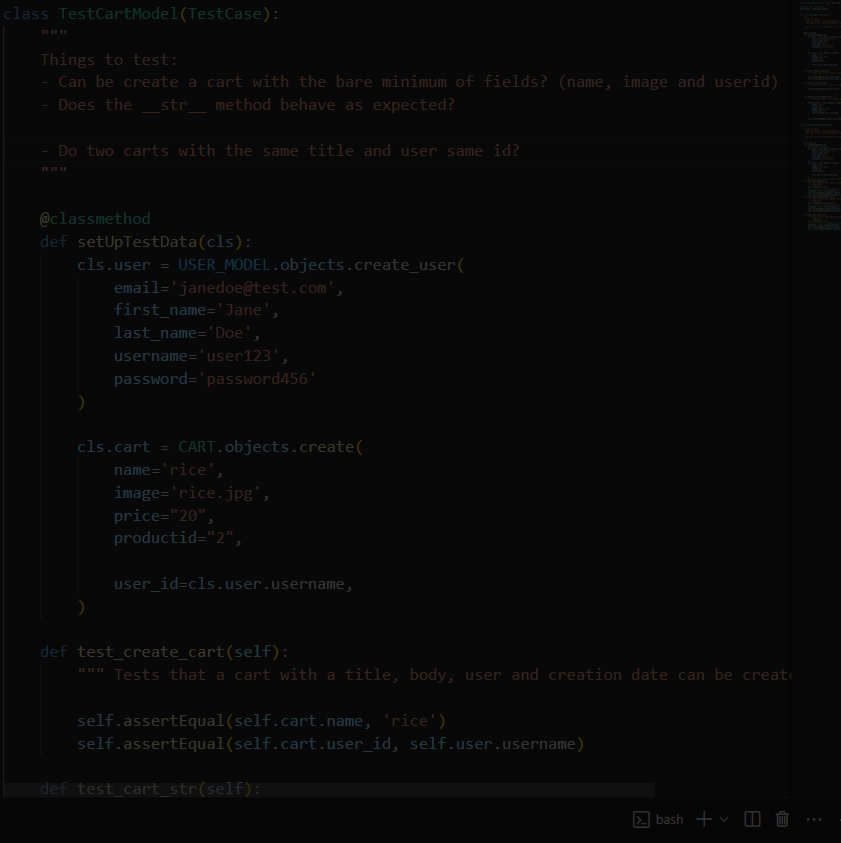

# CHOPS
This project [chops](https://chops-fee5c95170e3.herokuapp.com/) is a minimalistic eccormmerce site for the sales of different kinds of meals
<!--  -->
# User Experience (UX)
Key information for the app
this section provides insight into the UX process, focusing on who the app is for, the main aims of the project and how the app can help users meet their needs
<!-- 
 -->

# Project goals:<br>
 User able to login

 integrated alluth

 able to search for meal based on names
<!--   -->
<br>

able to add to cart even without logging in

sychronizing your cart after loggin in
<!--  -->

making purchase for more a meal multiple time
<!--  -->
<br>


# Features:<br>
Login
 <br>

Signup
 <br>

products
 <br>


# Project workflow:<br>

Auth <br>

The Project implement  django alluth for authentication<br>
AllAuth Takes care of all neccsary authentication template, authenication funtionalities


Product <br>
The project conatined already test data as a dictionary located in the settings.py file

<br>

The project use The browser localstorage to keep track of the cart and checkout system


# Responsiveness<br>

screen w-1700
 <br>


screen w-1500
 <br>

screen w-600
 <br>

screen w-350
 <br>


# ADMIN CREDENTIALS<br>
username dussy@gmail.com<br>
password Admin@123<br>


# Test<br>

 Tests that a GET request works and renders the correct template   

  <br>

  <br>

 Test Model
 The cart model

  <br>

  <br>


# Deployment<br>
``` make a new file name Procfile and do not put any extension in it. It is a file required by Heroku

. For our app we can write the following command "web: gunicorn name_of_your_app.wsgi -log-file -" in the procfile

. pip install gunicorn

. login into heroku in the browser

. Make a new heroku app

. update settings.py file ALLOWED_HOSTS = ["your_app_name.herokuapp.com"]

. With a couple of lines of config WhiteNoise allows your web app to serve its own static files, making it a self-contained unit that can be deployed anywhere without relying on nginx, Amazon S3 or any other external service

so run pip install whitenoise


Add it in MIDDLEWARE in settings.py file

MIDDLEWARE = [
   'django.middleware.security.SecurityMiddleware',
  'whitenoise.middleware.WhiteNoiseMiddleware',
   ...
]

.Make a new Github Repo and add all of your code in it.

.Using Heroku Postgres
Go to your app dashboard and in the Resources section search for Postgres and click add.


. Now paste the following code below DATABASES in settings file

db_from_env = dj_database_url.config(conn_max_age=600)
DATABASES['default'].update(db_from_env)


.Currently, your database is empty and you might want to fill it.

Open terminal
type → heroku login
After the login run the following commands
heroku run python manage.py makemigrations
heroku run python manage.py migrate ...

# Credits<br>
Full credit goes to code institute for the template provided to make this project a possiblityl


